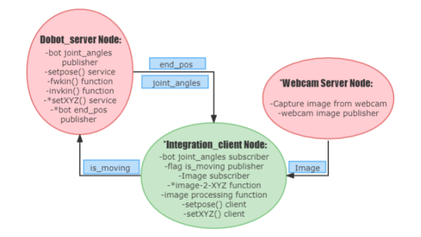

<h1>
  ROS Dobot Driver with Python
</h1>



* under development

## Project Description
This project aims to build a ROS library that supports an earlier version of Dobot. The ROS library will contain packages that enable low-level controls of Dobot such
as reading and controlling of joint angles, forward kinematics, inverse kinematics,
integrated with webcam.

## Preparation
- Linux / Ubuntu 20.04 (recommend standalone Ubuntu or WSL for Win11)
- Install [ROS Noetic](http://wiki.ros.org/noetic/Installation/Ubuntu)

## Installation
- Place dobot_driver into the src directory of the already created catkin workspace. 
- In the Ubuntu Terminal of /your_ws/ with the /devel file, type: 
```
$ catkin_make
```
## Usage
In dobot_driver/scripts, start the driver node by running
```
$ python3 dobot_server.py
```
In a separate terminal, subscribe to dobot joint angles by calling
```
$ rostopic echo /raw_angles
```
To directly control the joint angles of dobot, use
```
$ rosservice call /set_raw_angles "q1: 30.0
q2: 0.0
q3: 0.0
q4: 0.0"
ret: 1.0
```
to rotate the first joint by 30 degrees. 

A video walk through can be found [HERE](https://youtu.be/6ZQ8-gSWN50)


